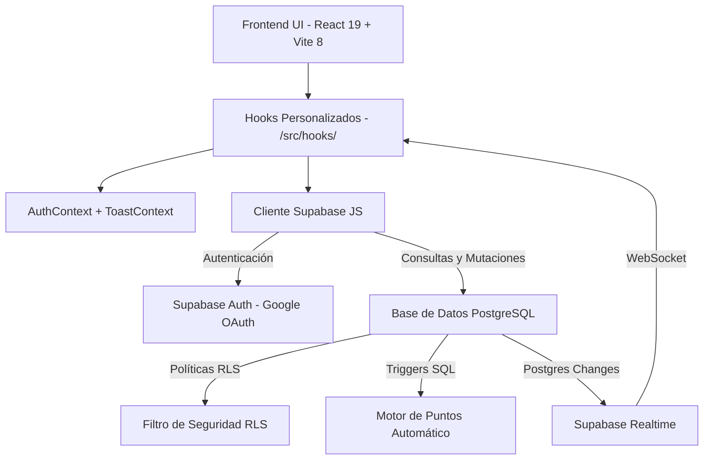

# ProdeMundial

Plataforma moderna y reactiva de pronósticos deportivos diseñada para competir en ligas privadas con amigos. Arquitectura serverless frontend-centric con lógica transaccional delegada en la base de datos.

---

## Características Principales

*   **Autenticación Segura**: Acceso mediante Google OAuth con gestión personalizada de perfiles de usuario.
*   **Gestión de Ligas Privadas**:
    *   Creación con generación automática de código de invitación único (6 caracteres).
    *   Tablas de clasificación en tiempo real (Realtime WebSocket).
    *   Muro interactivo de conversación (Trash Talk) en tiempo real.
    *   Premios y estadísticas automáticas: Rey del Exacto, Mejor Racha, El Optimista, Más Consistente.
    *   Comparador público de pronósticos entre participantes (visible 30 minutos antes del partido).
    *   Compartir acceso rápidamente con código de invitación.
*   **Pronósticos de Partidos**:
    *   Carga masiva y edición individual de marcadores para fase de grupos y eliminatorias.
    *   Historial de predicciones completo.
    *   Bloqueo automático 30 minutos antes del partido, validado por base de datos (RLS).
    *   Indicadores visuales de predicciones pendientes.
    *   Cuenta regresiva hasta el cierre de predicciones.
*   **Fase de Eliminatorias (Tournament Bracket)**:
    *   Cuadro interactivo adaptado a desktop y mobile.
    *   Filtros dinámicos por grupos y pestañas por etapa del torneo.
*   **Motor de Puntos en Servidor**:
    *   Triggers transaccionales en PostgreSQL: exacto = 3 pts, resultado correcto = 1 pt, incorrecto = 0 pts.
*   **Experiencia de Usuario**:
    *   Tema claro/oscuro con detección y guardado de preferencias.
    *   Skeletons de carga, toasts de notificación y animaciones de confirmación.
    *   Diseño glassmorphism responsivo.

---

## Inicio Rápido

### 1. Requisitos Previos
*   Node.js v18 o superior.
*   Una cuenta activa de Supabase.

### 2. Configuración del Entorno
```env
VITE_SUPABASE_URL=tu_supabase_url
VITE_SUPABASE_ANON_KEY=tu_supabase_anon_key
```

### 3. Instalación e Inicio
```bash
npm install
npm run dev
```

---

## Arquitectura del Sistema

ProdeMundial usa arquitectura desacoplada serverless (Frontend-Centric). React interactúa directamente con Supabase; las reglas críticas viven en PostgreSQL.



### Stack Tecnológico
*   **Frontend**: React 19, TypeScript ~6.0, Vite 8, Tailwind CSS v4.
*   **Backend**: Supabase (PostgreSQL, Auth, RLS, Triggers, RPC, Realtime).
*   **Testing**: Vitest 4, Testing Library, JSDom (unit/integration) + Playwright (E2E).

---

## Seguridad e Integridad (Antifraude)

La seguridad está blindada a nivel de base de datos. Aunque el cliente frontend fuera alterado, PostgreSQL rechaza cualquier operación inválida:

1.  **Restricción de Tiempo Límite (RLS)**: Predicciones bloqueadas 30 minutos antes del partido. Las políticas RLS rechazan cualquier INSERT o UPDATE tardío.
2.  **Motor de Puntos en Servidor**: Triggers transaccionales calculan los puntajes cuando el admin finaliza un partido (`finished`), garantizando coherencia instantánea.

---

## Estructura del Proyecto

*   `src/components/`: Componentes de UI (Bracket, Tabla de Posiciones, Chat, Modals, etc.).
*   `src/contexts/`: Estado global — `AuthContext` (sesión) y `ToastContext` (notificaciones).
*   `src/hooks/`: Capa de datos aislada. 17 hooks que encapsulan toda la interacción con Supabase.
*   `src/pages/`: Vistas de primer nivel (`Dashboard.tsx`).
*   `src/lib/`: Configuración del cliente Supabase y tipos compartidos.
*   `supabase/migrations/`: Scripts SQL de base de datos (tablas, RLS, triggers, RPCs).

---

## Documentación Adicional

*   [Arquitectura del Proyecto](./docs/architecture.md)
*   [Base de Datos y Reglas (RLS)](./docs/database.md)

---

## Comandos Disponibles

| Comando | Descripción |
|---|---|
| `npm run dev` | Inicia el servidor de desarrollo en `localhost:5173` |
| `npm run build` | Compila la aplicación optimizada para producción |
| `npm run test` | Ejecuta tests unitarios en modo interactivo (watch) |
| `npm run test:run` | Corre todos los tests unitarios/integración una sola vez |
| `npm run test:e2e` | Ejecuta la suite de tests E2E con Playwright |
| `npm run lint` | Valida el código con ESLint |
| `npm run preview` | Previsualiza el bundle de producción localmente |
