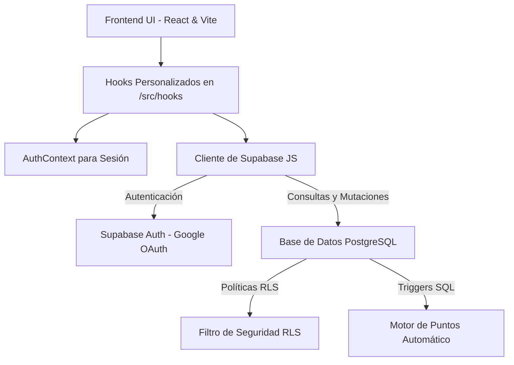

# 🏆 ProdeMundial

Plataforma moderna y reactiva de pronósticos deportivos (prodes) diseñada para competir en ligas privadas y públicas con amigos. Su arquitectura está optimizada para ser ligera, rápida y 100% segura mediante lógica transaccional delegada en la base de datos.

---

## ⚡ Inicio Rápido

### 1. Requisitos Previos
* Tener instalado [Node.js](https://nodejs.org/) (v18 o superior).
* Una cuenta de [Supabase](https://supabase.com/).

### 2. Configuración del Entorno
Cloná el repositorio y creá un archivo `.env` en la raíz del proyecto con tus credenciales de Supabase:
```env
VITE_SUPABASE_URL=tu_supabase_url
VITE_SUPABASE_ANON_KEY=tu_supabase_anon_key
```

### 3. Instalación e Inicio
```bash
# Instalar todas las dependencias
npm install

# Correr el servidor de desarrollo local
npm run dev

# Correr la suite de pruebas unitarias y de integración
npm run test:run
```

---

## 🏗️ Arquitectura del Sistema

ProdeMundial utiliza una arquitectura **desacoplada y serverless** (Frontend-Centric). El cliente React interactúa directamente con Supabase para autenticación y base de datos, delegando las reglas críticas de negocio a PostgreSQL para máxima seguridad.



### Stack Tecnológico
* **Frontend**: React 19, TypeScript, Vite 8, Tailwind CSS v4.
* **Backend**: Supabase (PostgreSQL, Auth, RLS, Triggers, RPC).
* **Testing**: Vitest 4, Testing Library, JSDom (Suite completa con mocks de Supabase).

---

## 🛡️ Seguridad e Integridad (Antifraude)

Toda la seguridad del sistema está blindada a nivel de base de datos. Incluso si el cliente frontend es alterado, las reglas de negocio de PostgreSQL impiden cualquier comportamiento malicioso:

1. **Restricción de Tiempo Limite (RLS)**: Las predicciones de los partidos se bloquean automáticamente **30 minutos antes del inicio** del encuentro. Las políticas de Row Level Security (RLS) rechazan cualquier `INSERT` o `UPDATE` tardío.
2. **Motor de Puntos en Servidor**: El cálculo de puntajes se realiza mediante triggers transaccionales directamente en la base de datos cuando el administrador finaliza un partido (`finished`), garantizando coherencia instantánea.
   * **Acierto Exacto**: 3 Puntos (marcador idéntico).
   * **Resultado Correcto**: 1 Punto (acierto de ganador o empate, pero goles distintos).
   * **Incorrecto**: 0 Puntos.

---

## 📁 Estructura del Proyecto

* `src/components/`: Componentes atómicos e interactivos de la interfaz (Bracket, Tabla de Posiciones, etc.).
* `src/contexts/`: Manejo de estados globales (ej: autenticación con Google).
* `src/hooks/`: Capa de datos aislada. Los componentes consumen la BD a través de hooks personalizados.
* `src/pages/`: Vistas de primer nivel (`Dashboard`, `Landing`, etc.).
* `supabase/migrations/`: Colección de scripts de base de datos (tablas, RLS, triggers y funciones RPC).

---

## 📂 Documentación Adicional

* 🗺️ [Arquitectura del Proyecto](./docs/architecture.md)
* 💾 [Base de Datos y Reglas (RLS)](./docs/database.md)

---

## 🛠️ Comandos Disponibles

| Comando | Descripción |
|---|---|
| `npm run dev` | Inicia el servidor de desarrollo local en `localhost:5173` |
| `npm run build` | Compila la aplicación optimizada para producción |
| `npm run test` | Ejecuta la suite de pruebas unitarias en modo interactivo |
| `npm run test:run` | Corre todos los tests unitarios y de integración una sola vez |
| `npm run lint` | Valida el formato y posibles errores del código mediante ESLint |
| `npm run preview` | Previsualiza el bundle compilado de producción localmente |
