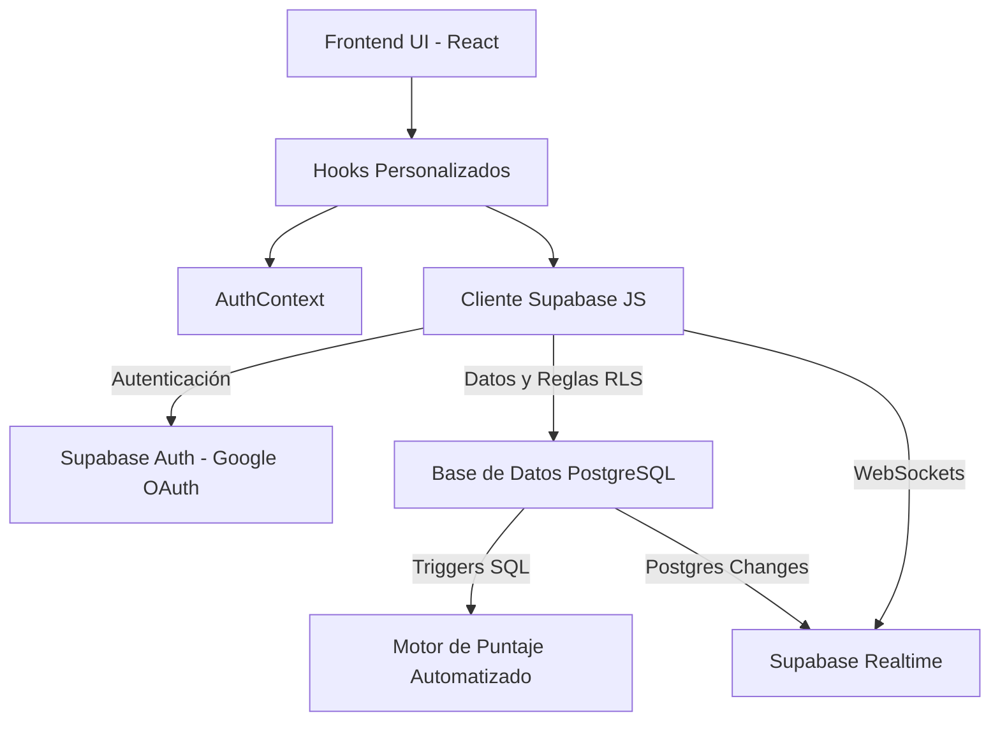

# Arquitectura Base de ProdeMundial

ProdeMundial es una aplicación web moderna de arquitectura **desacoplada y centrada en frontend**, que delega toda la responsabilidad del servidor backend (base de datos, autenticación y políticas de seguridad) a **Supabase (Backend as a Service)**.

## ¿Por qué esta arquitectura?

Al integrar Supabase directamente desde el cliente React logramos:
1. **Reducción de Latencia y Complejidad**: No hay una capa de servidor/API intermedia (como Node.js o Python) que mantener.
2. **Seguridad Inquebrantable**: Toda la validación de seguridad de los datos ocurre directamente en el motor de PostgreSQL a través de *Row Level Security* (RLS).
3. **Tiempo Real Nativo**: Sincronización instantánea de puntajes y chats (Trash Talk) mediante WebSocket vía Supabase Realtime, sin infraestructuras adicionales complejas.
4. **Desarrollo Ágil**: Permite a los desarrolladores enfocarse casi exclusivamente en la Experiencia de Usuario (UX) en el frontend.

## Diagrama de Flujo

## Estructura del Frontend

| Directorio | Responsabilidad Principal |
|------------|---------------------------|
| `src/contexts/` | Almacena estados globales de la aplicación que deben estar disponibles en todas las rutas (ej: `AuthContext` para conocer si el usuario inició sesión). |
| `src/hooks/` | **Encapsulamiento de Datos**: Toda consulta a Supabase vive aquí. Evitamos manchar los componentes visuales con peticiones a la BD. |
| `src/components/`| Componentes de Interfaz de Usuario altamente reutilizables y atómicos (Tarjetas de Partido, Botones, Spinners). |
| `src/pages/` | Vistas principales completas que agrupan los diferentes componentes (Ej: el `Dashboard`). |

## Patrones de Diseño Utilizados

- **Autenticación Descentralizada Reactiva**: Utilizamos el Context API de React (`AuthContext`) que reacciona proactivamente a los eventos de inicio y cierre de sesión que emite Supabase.
- **Separación de Intereses (Hooks vs UI)**: Los componentes funcionales no ejecutan consultas SQL ni promesas complejas. En su lugar, utilizan un Hook (como `const { predictions } = usePredictions()`) dejando el código limpio.
- **Estilos Basados en Utilidades (Tailwind v4)**: Implementación de componentes de diseño adaptativos sin acoplar hojas de estilos CSS externas, facilitando la creación del modo oscuro y el diseño "Glassmorphism".
