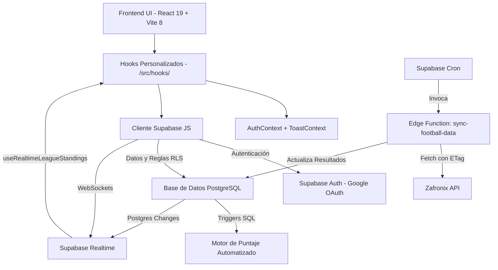

# Arquitectura de ProdeMundial

ProdeMundial es una aplicación web moderna de arquitectura **desacoplada y centrada en frontend**, que delega toda la responsabilidad del servidor backend (base de datos, autenticación y políticas de seguridad) a **Supabase (Backend as a Service)**.

## ¿Por qué esta arquitectura?

Al integrar Supabase directamente desde el cliente React logramos:
1. **Reducción de Latencia y Complejidad**: No hay una capa de servidor/API intermedia (como Node.js o Python) que mantener.
2. **Seguridad Inquebrantable**: Toda la validación de seguridad de los datos ocurre directamente en el motor de PostgreSQL a través de *Row Level Security* (RLS).
3. **Tiempo Real Nativo**: Sincronización instantánea de puntajes y chats (Trash Talk) mediante WebSocket vía Supabase Realtime, sin infraestructuras adicionales complejas.
4. **Desarrollo Ágil**: Permite a los desarrolladores enfocarse casi exclusivamente en la Experiencia de Usuario (UX) en el frontend.

## Diagrama de Flujo

## Sincronización de Datos (Edge Functions)

El torneo mundial es administrado mediante una Supabase Edge Function (`sync-football-data`) que corre periódicamente vía Cron:
- **Proveedor de Datos**: Consumimos la **Zafronix API** (especializada en el formato de 48 equipos y 12 grupos de 2026).
- **Eficiencia y Rate Limits**: Utilizamos llamadas condicionales (`If-None-Match`) guardando el último `ETag` en la tabla `api_sync_state`. Si los datos no cambiaron, la API responde HTTP 304, permitiéndonos realizar consultas frecuentes sin consumir la cuota de peticiones gratuitas.
- **Flujo**: La Edge Function consulta los partidos y las tablas de posiciones (standings), y actualiza las tablas `matches` y `group_standings` en PostgreSQL. Los triggers automáticos se encargan del resto (recalcular puntos).
- **Mitigación de Fuga de Datos (OWASP A10)**: Los errores producidos en la sincronización se envuelven y los logs detallados quedan exclusivamente en el servidor de Supabase. El cliente recibe un error genérico, ocultando los detalles de la base de datos a posibles atacantes.

## Estructura del Frontend

| Directorio | Responsabilidad Principal |
|------------|---------------------------|
| `src/contexts/` | Estados globales disponibles en toda la app: `AuthContext` (sesión del usuario) y `ToastContext` (notificaciones flotantes globales). |
| `src/hooks/` | **Encapsulamiento de Datos**: Toda consulta a Supabase vive aquí. Los componentes nunca tocan la BD directamente. |
| `src/components/` | Componentes de UI reutilizables y atómicos. Incluye elementos complejos como `TournamentBracket`, `LeagueChat`, `MatchPredictionsModal` y utilitarios como `Skeleton`, `ToastContainer`, `CountdownTimer`. |
| `src/pages/` | Vistas de primer nivel. Actualmente: `Dashboard.tsx` (vista principal completa). |
| `src/lib/` | Configuración compartida de bajo nivel (cliente Supabase, tipos generados). |

## Catálogo de Hooks

| Hook | Responsabilidad |
|------|-----------------|
| `useAuth` | Suscripción al estado de sesión de Supabase Auth |
| `useMatches` | Carga de partidos del torneo, filtrado por etapa/grupo |
| `usePredictions` | CRUD de pronósticos del usuario con locking automático |
| `usePendingPredictions` | Indicador de partidos sin pronosticar (badge) |
| `usePredictionHistory` | Historial completo de predicciones del usuario |
| `useLeagues` | Creación, adhesión y listado de ligas |
| `useLeagueStandings` | Tabla de posiciones de una liga específica |
| `useRealtimeLeagueStandings` | Re-export con suscripción Realtime para standings en vivo |
| `useLeagueChat` | Mensajes en tiempo real del Trash Talk de una liga |
| `useLeagueStats` | Premios y estadísticas avanzadas (RPCs) |
| `useLeagueAdmin` | Operaciones de administrador: cargar resultados, finalizar partidos |
| `useGlobalStandings` | Ranking global entre todos los usuarios de todas las ligas |
| `useStandings` | Posiciones generales (base para standings globales/locales) |
| `useMatchPredictions` | Pronósticos de un partido específico |
| `useMatchLeaguePredictions` | Comparador de pronósticos entre miembros de una liga por partido |
| `useCountdown` | Timer de cuenta regresiva hasta el `kickoff_time` de un partido |
| `useTheme` | Detección y persistencia del tema claro/oscuro del sistema |

## Componentes Principales

| Componente | Descripción |
|------------|-------------|
| `TournamentBracket` | Cuadro de eliminatorias interactivo (desktop) |
| `MobileBracket` | Versión móvil del bracket de eliminatorias |
| `BulkPredictionView` | Carga masiva de pronósticos para todos los partidos |
| `MatchCard` | Tarjeta individual de partido con estado y acciones |
| `MatchTabs` | Pestañas de navegación por etapas del torneo |
| `GroupFilter` | Filtro dinámico por grupos de la fase de grupos |
| `LeagueDetails` | Vista completa de detalle de una liga |
| `LeagueChat` | Muro de Trash Talk en tiempo real |
| `LeagueStats` | Panel de premios y estadísticas avanzadas |
| `StandingsTable` | Tabla de clasificación de liga |
| `GlobalStandings` | Ranking global con avatares |
| `MatchPredictionsModal` | Modal con comparador de pronósticos por partido |
| `MatchPredictionsList` | Lista de pronósticos de los participantes |
| `PredictionHistory` | Historial completo de predicciones del usuario |
| `ShareLeague` | Acceso rápido para compartir código de invitación |
| `ProfileModal` | Modal de perfil del usuario |
| `RulesModal` | Modal con las reglas del prode |
| `CountdownTimer` | Cuenta regresiva visible hasta el cierre de predicciones |
| `PendingBadge` | Indicador de pronósticos pendientes |
| `Skeleton` | Placeholders de carga animados |
| `SuccessAnimation` | Animación de confirmación de guardado |
| `ToastContainer` | Renderizador de notificaciones flotantes |

## Patrones de Diseño Utilizados

- **Autenticación Descentralizada Reactiva**: `AuthContext` reacciona proactivamente a los eventos de sesión que emite Supabase, sin polling.
- **Separación de Intereses (Hooks vs UI)**: Los componentes no ejecutan consultas SQL ni promesas complejas. Usan hooks (`const { predictions } = usePredictions()`) dejando el código visual limpio.
- **Toast Context Global**: `ToastContext` provee notificaciones flotantes accesibles desde cualquier hook o componente sin prop-drilling.
- **Estilos Basados en Utilidades (Tailwind v4)**: Configuración CSS-first sin archivos de configuración JS. Soporta modo oscuro y diseño glassmorphism.
- **Optimización de Reconciliación en React**: Uso estratégico de la propiedad `key` en componentes renderizados condicionalmente para evitar reciclaje erróneo de nodos del DOM durante transiciones CSS.
- **Evitación de Renders en Cascada**: Los hooks encargados de sincronizar la base de datos con la UI usan inicializaciones diferidas (lazy state) e impiden la sobreescritura sincrónica desde los `useEffect`, logrando actualizaciones de estado limpias y veloces.
- **Realtime por Suscripción**: `useRealtimeLeagueStandings` y `useLeagueChat` usan canales de Supabase Realtime (Postgres Changes + Broadcast) para sincronización instantánea sin polling.
